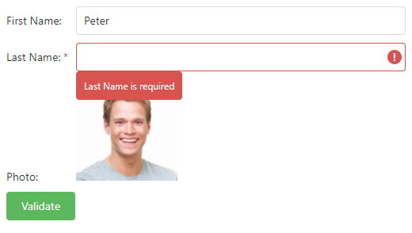

<!-- default badges list -->

<!-- default badges end -->
# Form for DevExtreme - How to customize form items

This example illustrates how to use the [template](https://js.devexpress.com/Documentation/ApiReference/UI_Widgets/dxForm/Item_Types/SimpleItem/#template) property to customize form items.

## Implementation Details

1. Implement a [template](https://js.devexpress.com/Documentation/ApiReference/UI_Widgets/dxForm/Item_Types/SimpleItem/#template) function for the "LastName" data field. In this template:
    - Create a [TextBox](https://js.devexpress.com/Documentation/ApiReference/UI_Widgets/dxTextBox/) editor.
    - Implement editor validation based on the synchronized [Form.validationGroup](https://js.devexpress.com/Documentation/ApiReference/UI_Widgets/dxForm/Configuration/#validationGroup) and [Validator.validationGroup](https://js.devexpress.com/Documentation/ApiReference/UI_Widgets/dxValidator/Configuration/#validationGroup) settings.
 
2. Implement a [template](https://js.devexpress.com/Documentation/ApiReference/UI_Widgets/dxForm/Item_Types/SimpleItem/#template) function with a static image for the "Photo" data field. 
 
## Files to Review

- **jQuery**
    - [index.html](jquery/index.html)    
- **Angular**
    - [app.component.html](angular/src/app/app.component.html)
    - [app.component.ts](angular/src/app/app.component.ts)
- **Angularjs**
    - [index.html](angularjs/index.html)   
- **Vue**
    - [App.vue](vue/src/App.vue)
- **React**
    - [App.js](react/src/App.js)
- **Mvc**    
    - [Index.cshtml](mvc/Views/Home/Index.cshtml)

## Documentation

- [Getting Started with Form](https://js.devexpress.com/Documentation/Guide/UI_Components/Form/Getting_Started_with_Form/)
- [Form - API Reference](https://js.devexpress.com/Documentation/ApiReference/UI_Components/dxForm/)
- [Data Validation](https://js.devexpress.com/Documentation/Guide/UI_Components/Common/UI_Widgets/Data_Validation/)
- [Validate and Submit the Form](https://js.devexpress.com/Documentation/Guide/UI_Components/Form/Validate_and_Submit_the_Form/)

## More Examples

- [DataGrid - How to implement a custom editing form using Form and Popup](https://github.com/DevExpress-Examples/DataGrid-How-to-implement-a-custom-editing-form-using-dxForm-and-dxPopup)
